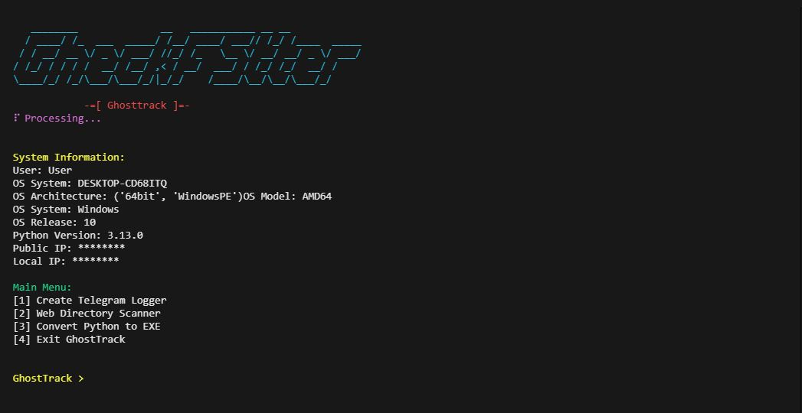

<h1 align="center">GhostTrack</h1>

  <b>A futuristic terminal-based Python toolkit for ethical hackers, developers, and automation enthusiasts.</b> 
  <i>Track, transform, and control systems like a ghost.</i>

  
  
  
  

---

## 📸 Preview

> 👇 GhostTrack in action:

  
  
  

---

## 🧠 What is GhostTrack?

GhostTrack is a cutting-edge Python CLI toolkit built with aesthetics and automation in mind. It allows you to:

- Analyze system & network information
- Scan websites for hidden directories
- Convert Python scripts into stylish .exe applications
- Auto-generate Telegram logger templates (educational use only)
- Enjoy futuristic animations in a terminal-based UX

---

## ✨ Features

| Module                 | Description                                                                 |
|------------------------|-----------------------------------------------------------------------------|
| 🧬 System Analyzer      | Displays public IP, local IP, OS, architecture, user, and more              |
| 🔍 Web Directory Scanner | Rapid scan of over 30+ common sensitive URLs (e.g. admin/, wp-login.php) |
| 📦 EXE Builder          | Convert .py to .exe with icon picker, output renamer & cleanup         |
| 📡 Telegram Logger      | Educational generator of system info fetcher for bot integration           |
| 🎭 CLI Aesthetics       | Typewriter effects, animated spinners, header banners & styled menus       |

---

## 📁 Directory Structure
ghosttrack/ ├── icons/                  ← Place your .ico files here ├── GhostTrack_Output/      ← Telegram logger output files ├── GhostTrack_EXE_Output/  ← Your compiled .exe files ├── ghosttrack.py           ← Main executable script ├── README.md               ← You're reading this └── requirements.txt        ← Python dependencies

---

## 🧪 Requirements

- Python ≥ 3.7
- pyinstaller
- requests
- colorama

Install with:

`bash
pip install -r requirements.txt

🔧 Manual Installation
pip install pyinstaller colorama requests

---

🚀 Quick Start

git clone https://github.com/yourusername/ghosttrack.git
cd ghosttrack
python ghosttrack.py

🔢 Choose from the main menu:

[1] Create Telegram Logger
[2] Web Directory Scanner
[3] Convert Python to EXE
[4] Exit GhostTrack

---

🧰 EXE Converter (Py to EXE)

✔ Interactive CLI
✔ Choose from Word/PDF/Image/Default/Custom icons
✔ Output .exe file saved to GhostTrack_EXE_Output
✔ Automatically removes .spec, build/, and dist/ after build

💡 Sample command (automated):

pyinstaller --noconfirm --onefile --icon="icons/pdf.ico" --name="MyApp" my_script.py

---

🔐 Ethical Use Only

> This tool includes features like IP fetching and system info collection intended for educational and testing purposes only.

You MUST NOT use this project to:

Access unauthorized systems

Spy or harvest personal data

Engage in cyber attacks

🛑 The author takes zero responsibility for any abuse.

---

📜 License

This project is licensed under the MIT License.

---

👨‍💻 Author & Credits

🔹 Created by: MohammadHossein

🔹 GitHub: https://github.com/NexNoir/

---

⭐️ Support the Project

If you enjoyed using GhostTrack or found it helpful:

➡️ Star this repo
➡️ Share it with friends
➡️ Suggest features via Issues
